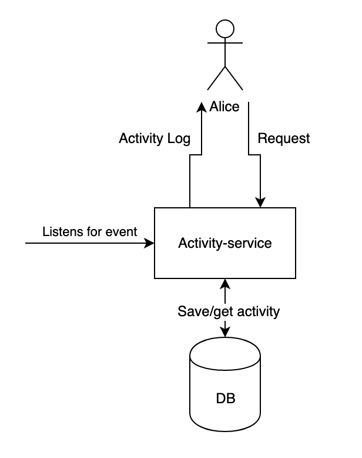

# `activity-service`

The activity service makes it possible for a user to see what actions have
been applied to a specific file or directory. It also makes it possible to get
an activity log for a specific user.

The services listens to the audit stream from storage-service and the 
file-favorite-service and for incoming events. These entries are transformed 
into an ActivityEvent and saved in the underlying database for further usage since Redis does not keep the events for ever.

When browsing a users activity, there is a chance that a lot of activity events
are of the same type within the same period, these gathered in groups. If the
group contains more than a certain number of entries, it will be
collapsed/hidden. This will not happen with any of the other endpoints in this
service.

<!--
__Which API will we provide?__

- We want to provide the user with a list of stuff they have done
  - Streamified
- We want to provide users with a list of stuff done to a file
  - Streamified
- We want to provide services (or admins) with a list of stuff done for a 
  file or by a user
  - Raw
  - "Streamified"

__We need to build three different kinds of report:__

1. Raw report (just contains raw information, we can do advanced queries on 
   these)
2. User report (Contains information about a users actions)
3. File report (Contains information about actions on a file)
   - Keyed on the file ID, we can lookup ID from path

__Streamified reports contain anonymized and grouped entries__

- Entry crated every x minutes (one for each type)
  - If there are n types, then we can only create n entries every x minutes
- When a new event enters the system we should find the correct entry or create
  a new one.
  - We can find the entry by looking for one which:
    - Is in the correct stream
    - Has the correct type
    - Was created within the last x minutes

__User reports and file reports have the same schema__

- A file report would only list for a single file
- A user report would only list for a single user
- We will, very much, duplicate data (that is okay)

__The source of truth will be Kafka__

- Kafka topics will not retain data forever
- The raw "stream" stored in the database can act as a recorded source of truth
  - The raw stream should be a reliable re-telling of the original stream
- It should be possible to build the reports directly from the raw stream
  - But the query would be quite advanced
  - The query would likely also be slow
  - Storage is cheap
  - UX improves drastically
  - We need computing power for reports that are never consumed

__Will the activity-service ever deal with other types of activity, for example
app-service activity?__

- No, but it is likely that we will need to change the service design (later)
  - Maintain a single activity-service. It should be capable of delivering a 
    merged and unified stream.
  - Maintain an interface (owned by activity-service) that describes the calls
    which should be available from an "activity-X-service"
  - Create an activity-file-service that does file stuff. More or less same
    implementation as current.
  - Create a new activity-app-service that does the same for apps.
  - Both should follow interface defined by activity-service. It is then 
    responsible for calling implementations and merging.
- Why not do this now? We need time to validate the design of the current
  activity-service.
--> 