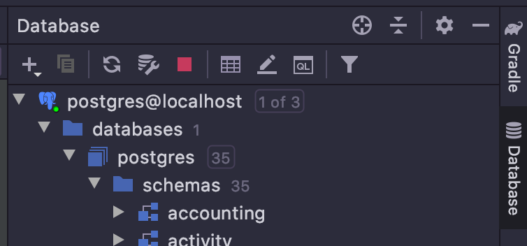
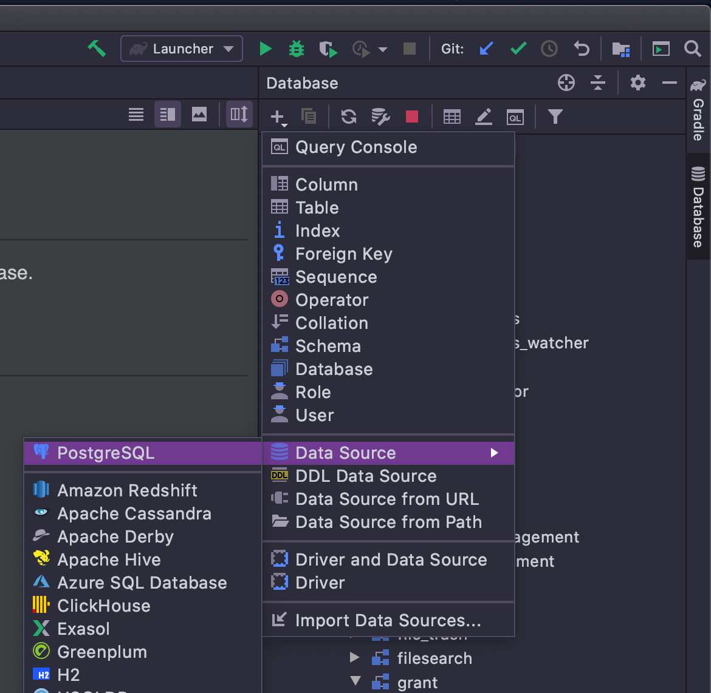
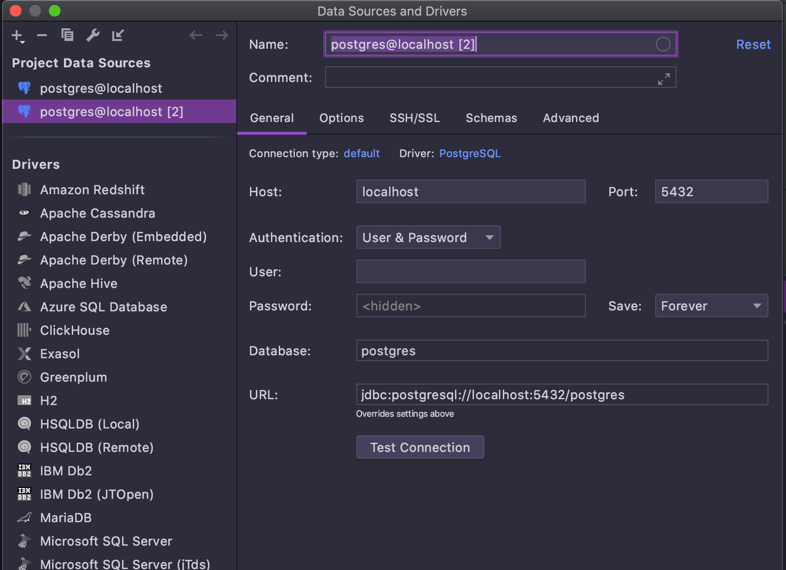
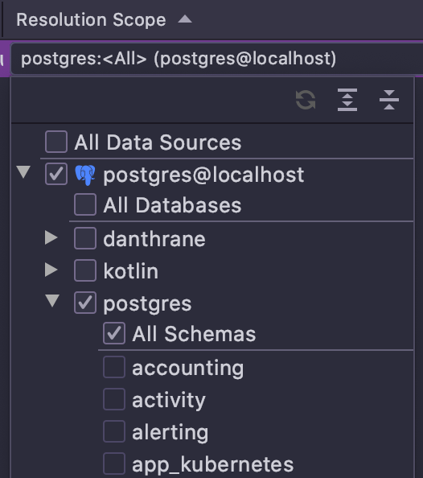

# Setting up IntelliJ for SQL Auto-Completion

Non macOS users: Replace `Cmd` + `Shift` + `A` with the 'Find action' menu item in IntelliJ. It should be available in
'Help'.

This tutorial assumes that you have set up a local Postgres database and have run migrations on your local database.

## Step 1: Configure the database in IntelliJ

Open the database pane in IntelliJ (`Cmd` + `Shift` + `A` and write 'database' or select it in the right toolbar).



Click the '+' to add a new datasource.



Configure the datasource to match your local setup and apply the configuration.



## Step 2: Configure SQL Resolution Scopes

SQL resolution scopes allow you to get correct auto-completion by automatically searching the relevant schemas.

Start by opening the settings for sql resolution scopes (`Cmd` + `Shift` + `A` and search for sql resolution scopes).


Click '+' and select the repository root folder. For the resolution scope uncheck 'All datasources' and select the 
correct database + 'All schemas'.



## Step 3: Write SQL Code

You should now be able to write normal SQL code from the microservices. Make sure to add a comment before the string
to indicate that the code is SQL. Example:

```kotlin
session
    .sendPreparedStatement(
        {
            setParameter("foo", "bar")
        },
        
        //language=sql
        """
            select :foo 
        """
    )
```
